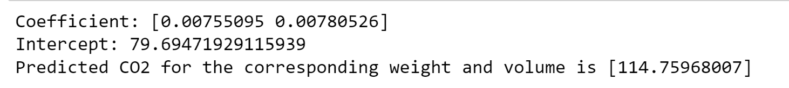

# Implementation of Multivariate Linear Regression
## Aim
To write a python program to implement multivariate linear regression and predict the output.
## Equipment’s required:
1.	Hardware – PCs
2.	Anaconda – Python 3.7 Installation / Moodle-Code Runner
## Algorithm:
## Step1:
Import pandas as pd.

## Step2:
Read the csv file.

## Step3:
Get the value of X and y variables.

## Step4:
Create the linear regression model and fit.

## Step5:
Predict the CO2 emission of a car where the weight is 2300kg, and the volume is 1300cm3.

## Step6:
Print the predicted output.
## Program:
```
To write a python program to implement multivariate linear regression and predict the output.
Developed by: Anitha P
Register Number: 21500186

import pandas as pd
from sklearn.cluster import KMeans
import matplotlib.pyplot as plt
import seaborn as sns
x1 = pd.read_csv('clustering.csv')
print(x1.head(2))
x2 = x1.loc[:,['ApplicantIncome','LoanAmount']]
print(x2.head(2))

x = x2.values
sns.scatterplot(x[:,0],x[:,1])
plt.xlabel('Income')
plt.ylabel('Loan')
plt.show()

kmeans=KMeans(n_clusters=4)
kmeans.fit(x)
print("Cluster centers:",kmeans.cluster_centers_)
print("Labels:",kmeans.labels_)
predict_class = kmeans.predict([[9000,1200]])
print("Cluster group for application income 9000 and loan amount 1200 is",predict_class)


```
## Output:


<br>

## Result
Thus the multivariate linear regression is implemented and predicted the output using python program.